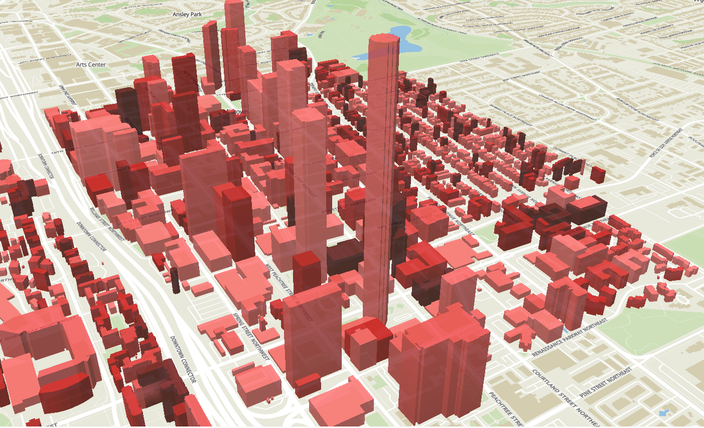
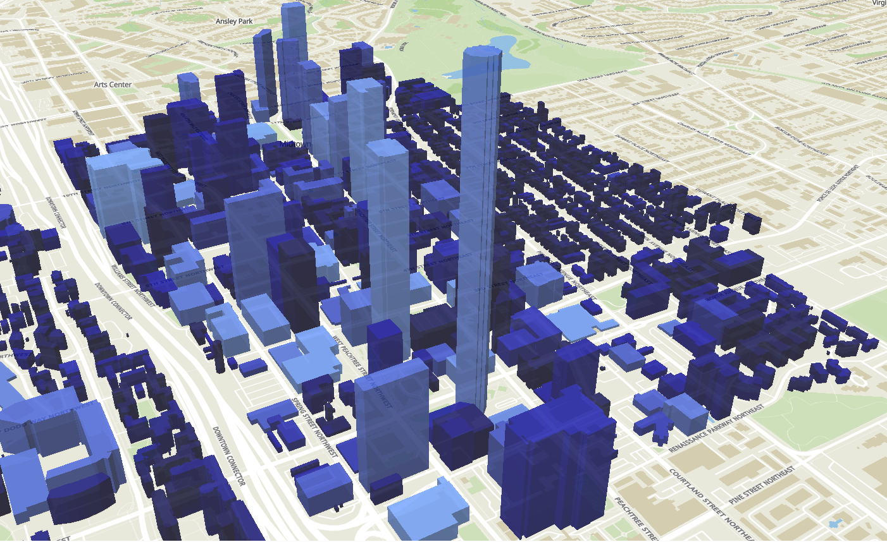

## Table of Contents
- [Rhino Energy Prediction Plugin](#rhino-energy-prediction-plugin)
  - [Overview](#overview)
  - [Features](#features)
  - [Architecture](#architecture)
  - [Installation](#installation)
  - [Workflow](#workflow)
  - [Requirements](#requirements)
  - [Tech Stack](#tech-stack)
  - [Roadmap](#roadmap)
  - [Give PlugIn standalone VIPEnergy tab so that future energy related plugins that work in the Rhino/GH environment may be added to this parent group.](#give-plugin-standalone-vipenergy-tab-so-that-future-energy-related-plugins-that-work-in-the-rhinogh-environment-may-be-added-to-this-parent-group)
- [Energy Map](#energy-map)
  - [Overview](#overview-1)
  - [Repository Structure](#repository-structure)
  - [Getting Started](#getting-started)
    - [Requirements](#requirements-1)
    - [Set up to run locally](#set-up-to-run-locally)
- [Map Information](#map-information)
    - [Datasets](#datasets)
- [Extracting Vegetation Data](#extracting-vegetation-data)
  - [Overview](#overview-2)
  - [NDVI Analysis](#ndvi-analysis)
  - [TreeCountSegHeight](#treecountsegheight)
  - [Next Steps](#next-steps)
  - [Presentation](#presentation)
  - [Team](#team)

---
# Rhino Energy Prediction Plugin

## Overview

Rhino Energy Prediction Plugin is designed to support architects in making energy-informed design decisions early in the building process. The plugin enables users to create or modify building models and receive predictions for heating and cooling loads using a machine learning (ML) model. Architects can gauge building energy performance early (concept stage) using the Rhino Energy Prediction Plugin. The plugin embeds a self-contained ONNX runtime directly in Grasshopper.

## Features

- **Model Initialization**  
  Reads an ONNX model file path and sets up an `InferenceSession` that exposes each input tensor’s name, datatype, and shape.

- **Real-Time Inference**  
  Packs Grasshopper inputs into dense tensors, executes the ONNX model, and returns the first element of the output array as an energy load estimate.

- **Automatic Feature Extraction**  
  Companion Python script reads 3D building geometry and computes features such as roof area, window-to-wall ratio, floor area, and number of stories.

- **Pure C# Runtime**  
  Runs entirely in .NET via Microsoft’s ONNX Runtime—no Python interpreter required at inference time.

## Architecture

1. **Component Initialization**  
   The plugin reads the ONNX model path from the Grasshopper input.  
   It then creates an `InferenceSession` and retrieves input tensor metadata.

2. **Input Packing**  
   Grasshopper values are loaded into dense tensors that match the ONNX input shapes.

3. **Model Inference**  
   The plugin runs the ONNX model with the packed inputs and receives an output array.  
   The first element of that array is sent to the Grasshopper output.

4. **Feature Extraction Script**  
   A Python helper extracts building features automatically by classifying layers named `Wall`, `Slab`, `Window`, and `Roof`.

## Installation

1. Download the `VIP_Energy_Plugin` folder.  
2. Copy it to your Grasshopper Libraries folder:
   ```
   C:\Users\YourUserName\AppData\Roaming\Grasshopper\Libraries
   ```
3. Launch Rhino and open Grasshopper.  
4. Drag the **VIPPlugin** component from the Params tab onto the canvas.  
5. Provide the ONNX model file path to the component input.  
6. View the energy load prediction on the second output parameter.

## Workflow

1. Open Rhino and start Grasshopper.  
2. Place the VIPPlugin component and connect the ONNX model path.  
3. Sketch or import a building mass in Rhino.  
4. Run the feature extraction script to compute geometry parameters.  
5. Grasshopper packs the inputs and runs the ONNX model.  
6. Inspect the real-time energy load estimate.

## Requirements

- **Rhino 7+** – Plugin host environment  
- **Windows OS** – .NET and Rhino SDK compatibility  
- **.NET Framework 4.8+** – ONNX Runtime support  
- **Python 3.8+** – Feature extraction and model conversion scripts  
- **ONNX model file** – Trained energy prediction model  

## Tech Stack

- **Rhino SDK (C#)** – Core plugin development and geometry handling  
- **Grasshopper (C#)** – Dynamic component architecture  
- **Microsoft ONNX Runtime** – High-performance model inference  
- **Python** – Building feature extraction and `.joblib` → `.onnx` conversion  
- **scikit-learn / sklearn-onnx** – Model training and conversion  

## Roadmap

- **Real-Time EUI Feedback**  
  Provide energy use intensity updates as users modify height, WWR, and story count.

- **Flexible Model Inputs**  
  Detect parameter names and types automatically to support multiple climates and typologies.

- **Multi-Format Support**  
  Add seamless handling of both `.onnx` and `.joblib` models with built-in feature mapping.

- **Map Integration**  
  Link with an energy prediction map to import existing building geometry and simulate retrofits.

- **Custom Tab**  
  Give PlugIn standalone VIPEnergy tab so that future energy related plugins that work in the Rhino/GH environment may be added to this parent group.
---
# Energy Map 


## Overview

<div align="center">
  
  
</div>

The energy map provides visualizations of predicted building energy loads (heating and cooling) across an urban environment. Users can click on individual buildings to inspect specific feature details such as building height and estimated energy loads.

Given a GeoJSON file, the application calculates various building features, including height, shape (e.g., L-shaped, H-shaped), number of stories, building type (residential, commercial, etc.), energy code classification, HVAC category, roof area, rotation, wall area, and window area. These extracted features are then fed into a machine learning model, as described here.


## Repository Structure
```
energy map
├─ api 
|  ├─ calculate_building_features # Scripts to calculate building-level features like height, area, rotation 
|  └─ route.ts # API routing configuration for feature calculations
|  
├─ flask-api # Backend Flask server 
|  
├─ node_modules # Dependency libraries (auto-generated)
├─ public # Static public assets
├─ src 
|  ├─ assets # Static files such as icons or images
|  ├─ App.tsx # Main application file
|  ├─ App.css # Application-level styling
|  ├─ index.css # Global styles
|  ├─ main.tsx # Application bootstrap and render entry
|  └─ components # React components for UI (buttons, feature displays, map container, map view) 
|     ├─ ButtonComponent.tsx
|     |  ├─ FeatureDisplay.tsx
|     |  ├─ MapContainer.tsx
|     |  ├─ MapView.tsx
|     └─ utils
|        └─ building.ts # Utility functions for parsing and handling building feature data
└─ ...
```
## Getting Started

### Requirements
1. Run with Python 3.12.5 (otherwise there are issues with the .pkl files)

2. Install [node.js](https://nodejs.org/en)

### Set up to run locally
1. Clone the repository using
   ```
   git clone https://github.com/VIP-SMUR/25Sp-EnergyInBuildings-Com.git
   ```
2. Navigate to the project folder
   ```
   cd energy_map
   ```
3. Run front end locally using
   ```
   npm run dev
   ```
4. To run the flask backend, open a new terminal and navigate to the energy_map/app/flask-api folder. Make sure to have the required python libraries. You can then run app.py without any errors
   ```
   pip install -r /path/to/requirements.txt

   python app.py
   ```

# Map Information

### Datasets

The dataset is derived from the [Overture Maps Foundation](https://overturemaps.org/) building footprints, provided in GeoJSON

---

# Extracting Vegetation Data

## Overview

We examined various methods of extracting vegetation data for use with the models due to the effect of shading on the heating and cooling load of nearby buildings.

## NDVI Analysis

NDVI (Normalized Difference Vegetation Index) is a metric used to quantify the health and density of vegetation from satellite imagery. Seemed promising at first, but does 
not provide any way of estimating vegetation height, which is likely needed as a metric for the model to be trained on.

## [TreeCountSegHeight](https://github.com/sizhuoli/TreeCountSegHeight)

A recently developed model called TreeCountSegHeight was also examined for potential integration with the model. It seemed to fit our purposes quite well, returning an estimate
of tree height from input satellite imagery, but was found to be very computationally intensive. It may have the potential to yield results given sufficient hardware, but this was
a stumbling point in the workflow. 

## Next Steps

Continue searching for a lightweight/efficient way to extract vegetation height from satellite imagery.


## Presentation

<a href="https://www.youtube.com/watch?v=4AXZ__TYZlY" target="_blank" rel="noopener noreferrer">
    
</a>

## Team

| Name                | Seniority | Major                  | School | # Semesters | GitHub Handle                                 | 
| ------------------- | --------- | ---------------------- | ------ | ----------- | --------------------------------------------- | 
| Joseph M. Aerathu   | Masters   | Architecture (HPB)     | ARCH   | 2           | [jma1999][gh-jma1999]                         | 
| Anubha Mahajan      | Senior    | Computer Science       | SCS    | 3           | [amahajan68][gh-amahajan68]                   | 
| Jessica Hernandez   | Masters   | Computer Science       | SCS    | 2           | [jhernandez312][gh-jhernandez312]             | 
| Hang Xu             | PhD       | Architecture (HBP)     | ARCH   | 2           | [HangXXXu][gh-hangxxxu]                       | 
| Jiayi Li            | Junior    | Architecture           | ARCH   | 2           | [jli3307][gh-jli3307]                         | 
| Kavya Lalith        | Sophomore | Computer Engineering   | ECE    | 1           | [kavya‑oop][gh-kavya-oop]                     | 
| Johnny Chen         | Freshman  | Computer Science       | SCS    | 1           | [jxchen21][gh-jxchen21]                       | 
| Shivam Patel        | Junior    | Computer Science       | SCS    | 3           | [FlippyShivam][gh-flippyshivam]               | 
| Yichao Shi          | PhD       | Architecture (DC)      | ARCH   | 2           | [SHIyichao98][gh-shiyichao98]                 | 


[gh-jma1999]:                   https://github.com/jma1999
[gh-mlim70]:                     https://github.com/mlim70
[gh-alvarezdmarch]:              https://github.com/alvarezdmarch
[gh-changdama]:                  https://github.com/changdama
[gh-amahajan68]:                 https://github.com/amahajan68
[gh-jhernandez312]:              https://github.com/jhernandez312
[gh-benjaminhansyun]:            https://github.com/hshih38
[gh-thanasarn-changnawa]:        https://github.com/Thanasarn-Changnawa
[gh-hangxxxu]:                   https://github.com/HangXXXu
[gh-jxu037]:                     https://github.com/JXU037
[gh-jli3307]:                    https://github.com/jli3307
[gh-mcenglish]:                  https://github.com/mcenglish
[gh-kavya-oop]:                  https://github.com/kavya-oop
[gh-krishgupta-ce]:              https://github.com/krishgupta-CE
[gh-vdwang]:                     https://github.com/vdwang
[gh-cgwallis]:                   https://github.com/cgwallis
[gh-atharvabeesen]:              https://github.com/AtharvaBeesen
[gh-paradoxwalk]:                https://github.com/paradoxwalk
[gh-masonrd]:                    https://github.com/Masonrd
[gh-jxchen21]:                   https://github.com/jxchen21
[gh-yupengtang]:                 https://github.com/yupengtang
[gh-daytss]:                     https://github.com/daytss
[gh-gvegasol]:                   https://github.com/gvegasol
[gh-sinarahimi]:                 https://github.com/sinarhm
[gh-zeyujiang8800]:              https://github.com/zeyujiang8800
[gh-nstone213]:                  https://github.com/nstone213
[gh-dodesimo]:                   https://github.com/Dodesimo
[gh-nithish101]:                 https://github.com/nithish101
[gh-flippyshivam]:               https://github.com/FlippyShivam
[gh-xyrro]:                      https://github.com/Xyrro
[gh-shiyichao98]:                https://github.com/SHIyichao98

[topic-energy-in-buildings]:         ../../25sp-energyinbuildings
[topic-mponc]:                       ../../25sp-mponc
[topic-microclimate-umcf]:           ../../25sp-microclimate-umcf
[topic-neuroarchitecture]:           ../../25sp-neuroarchitecture
[topic-microclimate-lstm-kriging]:   ../../25sp-microclimate-lstm-kriging
[topic-mobility-pei]:                ../../25sp-mobility-pei
